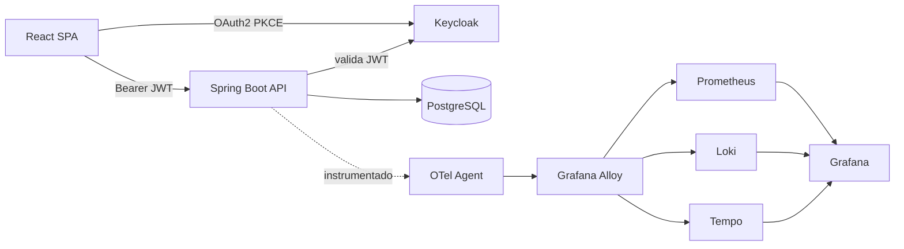

# Sistema de Gestión de Inventarios Empresarial

[](https://github.com/Janner11/inventory-system/actions/workflows/ci.yml)
[](https://github.com/Janner11/inventory-system/actions/workflows/security-scan.yml)
[](https://github.com/Janner11/inventory-system/actions/workflows/performance-test.yml)
[-brightgreen)](docs/cicd/sonarqube.md)
[](docs/cicd/sonarqube.md)
[](backend/build.gradle.kts)
[](frontend/package.json)
[](#licencia)

> Los badges de **Quality Gate** y **Coverage** son estáticos (no hay un
> servidor SonarQube/Codecov público y persistente para este proyecto
> académico — SonarQube corre efímero por job de CI o localmente vía
> `docker-compose.dev.yml`, ver [`docs/cicd/sonarqube.md`](docs/cicd/sonarqube.md)).
> Reflejan la última verificación real documentada, no un estado en vivo.

Sistema de gestión de inventarios para pequeñas empresas — desarrollado como
proyecto académico para la asignatura **Aseguramiento de Calidad de
Software** (PUCMM). Además de la funcionalidad de negocio (productos, stock,
auditoría, reportes), el proyecto es una demostración completa de prácticas
modernas de ingeniería: testing en 6 niveles, seguridad con autorización
granular por scope, observabilidad de punta a punta (métricas + logs +
trazas correlacionados) y dos pipelines CI/CD completos (GitHub Actions y
Jenkins).

## Índice

- [Stack tecnológico](#stack-tecnológico)
- [Arquitectura](#arquitectura)
- [Requisitos previos](#requisitos-previos)
- [Instalación y quickstart](#instalación-y-quickstart)
- [Variables de entorno](#variables-de-entorno)
- [Estructura del proyecto](#estructura-del-proyecto)
- [Comandos de desarrollo](#comandos-de-desarrollo)
- [Testing](#testing)
- [Observabilidad](#observabilidad)
- [Seguridad](#seguridad)
- [CI/CD](#cicd)
- [Despliegue](#despliegue)
- [Documentación adicional](#documentación-adicional)
- [Contribución](#contribución)
- [Licencia](#licencia)

## Stack tecnológico

| Capa | Tecnología | Versión |
|---|---|---|
| Frontend | React + Vite | React 18.3, Vite 5.4 |
| | React Router DOM | 6.28 |
| | TanStack Query (React Query) | 5.101 |
| | React Hook Form | 7.79 |
| | keycloak-js | 24.0 |
| Backend | Spring Boot | 3.3.5 (Java 21) |
| | Spring Security (OAuth2 Resource Server) | vía Spring Boot BOM |
| | Spring Data JPA + Hibernate Envers | vía Spring Boot BOM |
| | Flyway | vía Spring Boot BOM |
| | springdoc-openapi (Swagger UI) | 2.6.0 |
| Base de datos | PostgreSQL | 16 |
| Identidad | Keycloak | 24 |
| Testing | JUnit 5, Mockito, AssertJ, Testcontainers, RestAssured, Playwright, k6, JaCoCo | — |
| Seguridad | OWASP ZAP, OWASP Dependency-Check, Trivy | — |
| Observabilidad | OpenTelemetry Java Agent, Prometheus, Grafana Loki, Grafana Tempo, Grafana Alloy, Grafana, Alertmanager, cAdvisor | — |
| DevOps | Docker, Docker Compose v2, GitHub Actions, Jenkins, SonarQube Community, GHCR | — |

Sin frameworks de CSS (Tailwind/Bootstrap) — CSS puro con CSS Modules y
design tokens (`frontend/src/styles/variables.css`), requisito explícito de
la consigna académica.

## Arquitectura

Diagrama de componentes, modelo de datos, flujo de autenticación OAuth2
PKCE y arquitectura de observabilidad — con diagramas Mermaid — en
[`docs/architecture.md`](docs/architecture.md).



## Requisitos previos

Para levantar todo vía Docker Compose (recomendado):

- **Docker Desktop** o Docker Engine + **Docker Compose v2** (`docker compose`, no `docker-compose`)

Para desarrollo fuera de Docker (frontend en modo `npm run dev`, backend
con `./gradlew`, o correr los tests localmente):

- **Node.js 20** (frontend)
- **JDK 21** (backend — el proyecto usa el toolchain de Gradle, cualquier
  distribución de JDK 21 sirve)
- **Git**

## Instalación y quickstart

```bash
# 1. Clonar el repositorio
git clone https://github.com/Janner11/inventory-system.git
cd inventory-system

# 2. Variables de entorno
cp .env.example .env

# 3. Levantar toda la infraestructura + backend
docker compose -f docker-compose.dev.yml up -d --build

# 4. Verificar que todo esté saludable (puede tardar ~1 min en el primer arranque)
docker compose -f docker-compose.dev.yml ps

# 5. Levantar el frontend (fuera de Docker, en otra terminal)
cd frontend
cp .env.example .env
npm install
npm run dev
```

Acceder a **http://localhost:5173**, iniciar sesión con
`admin@test.com` / `admin123` (ver [Seguridad](#seguridad) para el resto de
usuarios de prueba y sus permisos).

| Servicio | URL | Credenciales |
|---|---|---|
| Frontend (SPA) | http://localhost:5173 | — |
| Backend (API) | http://localhost:8081/api/ping | — |
| Swagger UI | http://localhost:8081/swagger-ui/index.html | — |
| Backend (Actuator) | http://localhost:8081/actuator/health | — |
| Keycloak | http://localhost:8080 | `admin` / `admin` (consola admin) |
| Grafana | http://localhost:3000 | `admin` / `admin` |
| Prometheus | http://localhost:9090 | — |
| Alertmanager | http://localhost:9093 | — |
| Jenkins | http://localhost:8095 | ver `JENKINS_ADMIN_*` en `.env` |
| SonarQube | http://localhost:9001 | `admin` / `admin` (primer login) |

Para detener todo: `docker compose -f docker-compose.dev.yml down` (agregar
`-v` para también borrar los volúmenes de datos).

## Variables de entorno

Documentadas con valor de ejemplo en [`.env.example`](.env.example) (dev),
[`.env.staging.example`](.env.staging.example) (staging) y
[`.env.production.example`](.env.production.example) (production). Resumen
de las más relevantes para levantar el proyecto:

| Variable | Descripción | Default (dev) |
|---|---|---|
| `POSTGRES_DB` / `_USER` / `_PASSWORD` | Base de datos de la aplicación | `inventario` / `inventario_user` / `inventario_pass` |
| `KEYCLOAK_ADMIN` / `_ADMIN_PASSWORD` | Credenciales de la consola admin de Keycloak | `admin` / `admin` |
| `KEYCLOAK_ISSUER_URI` | Issuer público del realm (debe coincidir con el `iss` del JWT) | `http://localhost:8080/realms/inventario` |
| `KEYCLOAK_JWK_SET_URI` | JWKS interno (red Docker) usado por el backend para validar firmas | `http://keycloak:8080/.../certs` |
| `KEYCLOAK_CLIENT_SECRET` | Secret del client confidencial `inventario-backend` | `inventario-backend-secret` (solo dev) |
| `BACKEND_PORT` | Puerto del backend | `8081` |
| `CORS_ALLOWED_ORIGINS` | Orígenes permitidos por CORS | `http://localhost:5173` |
| `OTEL_EXPORTER_OTLP_ENDPOINT` / `_PROTOCOL` | Endpoint del colector OTLP (Alloy) — protocolo debe ser `grpc` | `http://alloy:4317` / `grpc` |
| `VITE_API_BASE_URL` | Base URL de la API que consume el frontend | `http://localhost:8081/api` |
| `VITE_KEYCLOAK_*` | URL/realm/client ID de Keycloak para `keycloak-js` | ver `frontend/.env.example` |
| `SONAR_TOKEN` / `SONAR_HOST_URL` | Opcionales — sin ellas, CI usa un SonarQube efímero | — |
| `NVD_API_KEY` | Opcional — acelera las actualizaciones de OWASP Dependency-Check | — |

Ver también la sección 15 de `CLAUDE.md` (local) para el detalle exhaustivo
por servicio, y [`docs/deployment.md`](docs/deployment.md) para
`.env.staging`/`.env.production`.

## Estructura del proyecto

```
inventory-system/
├── frontend/                  → SPA React + Vite
│   ├── src/
│   │   ├── components/        → common/, layout/, dashboard/, products/, stock/
│   │   ├── pages/              → una página por ruta
│   │   ├── hooks/               → useAuth, useProducts, useStock, useDashboard (React Query)
│   │   ├── services/            → axiosConfig.js, keycloak.js, *Service.js
│   │   └── styles/               → variables.css (design tokens) + CSS Modules
│   ├── tests/unit/             → Vitest + React Testing Library
│   └── tests/e2e/               → Playwright
├── backend/                   → API REST Spring Boot 3 (Java 21)
│   └── src/main/java/com/inventario/
│       ├── controller/ service/ repository/ entity/ dto/ mapper/
│       ├── config/             → SecurityConfig, OpenAPIConfig, BusinessMetricsConfig
│       ├── security/            → JwtAuthConverter y conversores de scopes
│       └── audit/                → Hibernate Envers (autor de cada revisión)
│   └── src/test/java/com/inventario/
│       ├── unit/ integration/ api/
├── keycloak/realm.json        → Realm completo exportado (reproducible, ADR-008)
├── observability/             → Config de Prometheus, Alloy, Loki, Tempo, Alertmanager, Grafana
├── jenkins/                    → Dockerfile + Configuration as Code del controlador Jenkins
├── scripts/                    → wait-for-it.sh, start-staging.sh, start-production.sh, seed-staging.sh, zap-report-gate.py
├── tests/performance/          → Scripts k6 (load/stress/soak)
├── docs/                       → Documentación técnica (ver abajo)
├── docker-compose.dev.yml      → Entorno de desarrollo local (14 servicios)
├── docker-compose.staging.yml  → Entorno de staging (imágenes publicadas, sin defaults de credenciales)
├── docker-compose.production.yml → Entorno de production (mismo esquema que staging, sin seed de datos)
├── Jenkinsfile                 → Pipeline declarativo (paridad con ci.yml)
└── .github/workflows/          → ci.yml, security-scan.yml, performance-test.yml
```

## Comandos de desarrollo

### Backend

```bash
cd backend
./gradlew compileJava                       # compilar
./gradlew bootRun                            # ejecutar (requiere Postgres/Keycloak arriba)
./gradlew test                               # unit + integration + API (Testcontainers)
./gradlew test --tests "com.inventario.unit.*"   # solo unit tests
./gradlew test jacocoTestReport jacocoTestCoverageVerification   # + gate de cobertura
./gradlew sonar                              # análisis SonarQube (requiere servidor, ver docs/cicd/sonarqube.md)
./gradlew dependencyCheckAnalyze             # OWASP Dependency-Check
```

### Frontend

```bash
cd frontend
npm run dev          # servidor de desarrollo (puerto 5173)
npm run build         # build de producción (dist/)
npm run test           # unit tests (Vitest)
npm run test:e2e        # E2E (Playwright, requiere el stack completo levantado)
```

### Docker / infraestructura

```bash
docker compose -f docker-compose.dev.yml up -d --build   # levantar todo
docker compose -f docker-compose.dev.yml ps                # estado de los servicios
docker compose -f docker-compose.dev.yml logs -f backend    # logs de un servicio
docker compose -f docker-compose.dev.yml down -v              # detener y borrar volúmenes

docker build -t inventario-backend:dev ./backend    # build de la imagen de producción
docker build -t inventario-frontend:dev ./frontend
```

### Staging / Production

```bash
cp .env.staging.example .env.staging      # ajustar valores reales
./scripts/start-staging.sh                 # arranque secuencial completo (≈48s)

cp .env.production.example .env.production # ajustar valores reales
./scripts/start-production.sh               # mismo mecanismo, sin capacidad de seed
```

Ver [Despliegue](#despliegue).

## Testing

248 tests de backend (unit + integration + API), 62 tests unitarios de
frontend, 54 tests E2E (Playwright × 2 browsers), 3 escenarios de
performance (k6) y security scanning (ZAP, Dependency-Check, Trivy) —
0 vulnerabilidades HIGH/CRITICAL sin justificar. Estrategia completa,
comandos exactos y tabla de cada clase de test en
[`docs/testing/testing-strategy.md`](docs/testing/testing-strategy.md).

```bash
cd backend && ./gradlew test          # 248 tests
cd frontend && npm run test            # 62 tests
cd frontend && npx playwright test      # 54 tests (requiere el stack levantado)
```

## Observabilidad

Backend instrumentado automáticamente con el OpenTelemetry Java Agent (sin
tocar código de producción) — métricas, logs y trazas correlacionados,
visualizados en 4 dashboards de Grafana provisionados como código
(Aplicación, Infraestructura, Negocio, Seguridad) con 5 reglas de alerta
activas. Arquitectura completa, flujo de datos y guía de "dónde mirar según
lo que se busca" en [`docs/observability/README.md`](docs/observability/README.md).

## Seguridad

Autorización granular por **scope individual** (nunca por rol genérico),
OAuth2 Authorization Code + PKCE desde el frontend, 5 roles de realm
(`ADMIN`/`MANAGER`/`WAREHOUSE`/`VIEWER`/`AUDITOR`) sobre 8 scopes —
incluyendo `actuator:view` (SEC-004), que protege `/actuator/prometheus` y se
asigna también al service account de `inventario-backend` para que Prometheus
se autentique con `client_credentials` real. Realm completo, usuarios de
prueba y cómo el backend valida cada JWT en
[`docs/security/keycloak.md`](docs/security/keycloak.md).

## CI/CD

Dos pipelines en paridad completa (mismos comandos, mismo orden de stages):
**GitHub Actions** (`.github/workflows/ci.yml`) y **Jenkins**
(`Jenkinsfile`, controlador con Configuration as Code en `jenkins/`). Build
→ unit tests → SonarQube → integration/API tests → build de imágenes Docker
→ Trivy → deploy a staging → E2E → security scan → push a GHCR (solo en
`main`). Detalle de cada stage, secrets requeridos y cómo reproducirlo
localmente en `CONTRIBUTING.md`, [`docs/cicd/jenkins.md`](docs/cicd/jenkins.md)
y [`docs/cicd/sonarqube.md`](docs/cicd/sonarqube.md).

## Despliegue

Los 3 ambientes que exige la consigna — Development
(`docker-compose.dev.yml`), Preview/Staging (`docker-compose.staging.yml`,
arranque completo en 48s) y Production (`docker-compose.production.yml`,
mismo esquema, sin capacidad de sembrar datos de prueba) —, los 2 últimos
verificados end-to-end contra el stack real, en
[`docs/deployment.md`](docs/deployment.md).

## Documentación adicional

| Documento | Contenido |
|---|---|
| [`docs/requirements.md`](docs/requirements.md) | Requisitos funcionales y no funcionales, trazables a código |
| [`docs/user-manual.md`](docs/user-manual.md) | Manual de usuario ilustrado con capturas reales |
| [`docs/architecture.md`](docs/architecture.md) | Diagramas de arquitectura, modelo de datos, flujo de auth, ADRs |
| [`docs/security/keycloak.md`](docs/security/keycloak.md) | Realm, scopes, roles, usuarios de prueba |
| [`docs/observability/README.md`](docs/observability/README.md) | Stack de observabilidad, flujo de datos, [`loki-queries.md`](docs/observability/loki-queries.md), [`alerts.md`](docs/observability/alerts.md) |
| [`docs/testing/testing-strategy.md`](docs/testing/testing-strategy.md) | Los 6 niveles de testing, comandos, dónde vive cada suite |
| [`docs/testing/test-cases.md`](docs/testing/test-cases.md) | Casos de prueba manuales ejecutables por módulo |
| [`docs/testing/qa-evidence.md`](docs/testing/qa-evidence.md) | Resumen ejecutivo de evidencia real de calidad (tests, cobertura, seguridad, rendimiento) |
| [`docs/testing/exploratory-testing-report.md`](docs/testing/exploratory-testing-report.md) | 3 sesiones de exploratory testing (SBTM) y hallazgos |
| [`docs/deployment.md`](docs/deployment.md) | Staging y producción |
| [`docs/staging.md`](docs/staging.md) | Detalle operativo del entorno de staging |
| [`docs/performance.md`](docs/performance.md) | Resultados reales de los 3 escenarios de k6 |
| [`docs/cicd/jenkins.md`](docs/cicd/jenkins.md) | Arquitectura del pipeline Jenkins |
| [`docs/cicd/sonarqube.md`](docs/cicd/sonarqube.md) | Quality Gate, arranque, integración en CI |
| `CONTRIBUTING.md` | Flujo de ramas, pipeline de CI, secrets |
| `CLAUDE.md` *(local, no versionado)* | Historial completo de decisiones día a día por ticket |

## Contribución

Git Flow (`main`/`develop` protegidas, ramas `feat/*`/`fix/*`/`chore/*`) y
[Conventional Commits](https://www.conventionalcommits.org/). Cada PR
requiere al menos 1 aprobación y pasar el pipeline de CI (unit tests,
SonarQube Quality Gate, integration/API tests, build de imágenes, Trivy).
Ver [`CONTRIBUTING.md`](CONTRIBUTING.md) para el detalle completo, incluyendo
cómo reproducir el pipeline localmente antes de abrir un PR.

## Licencia

Proyecto académico desarrollado para la asignatura Aseguramiento de Calidad
de Software — Pontificia Universidad Católica Madre y Maestra (PUCMM). Sin
licencia de código abierto formal; uso educativo.
