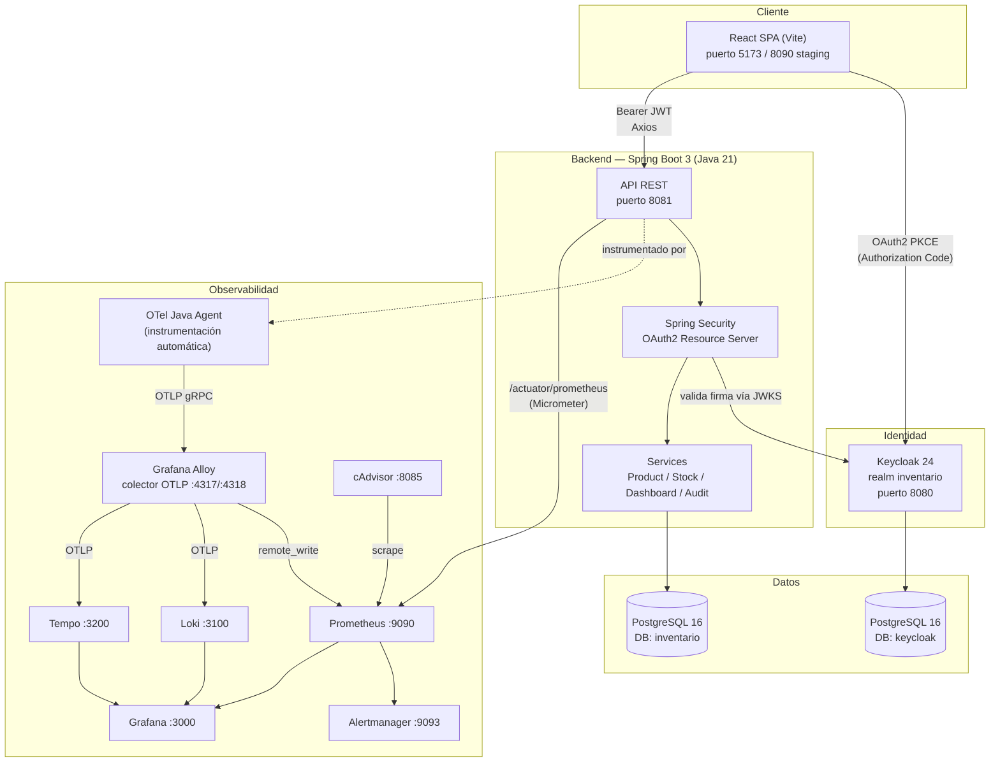
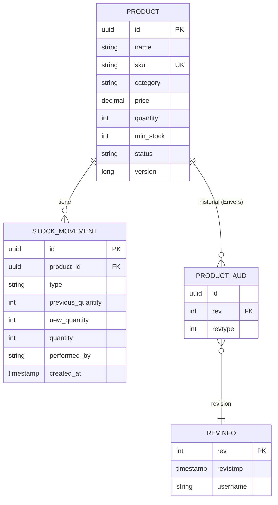
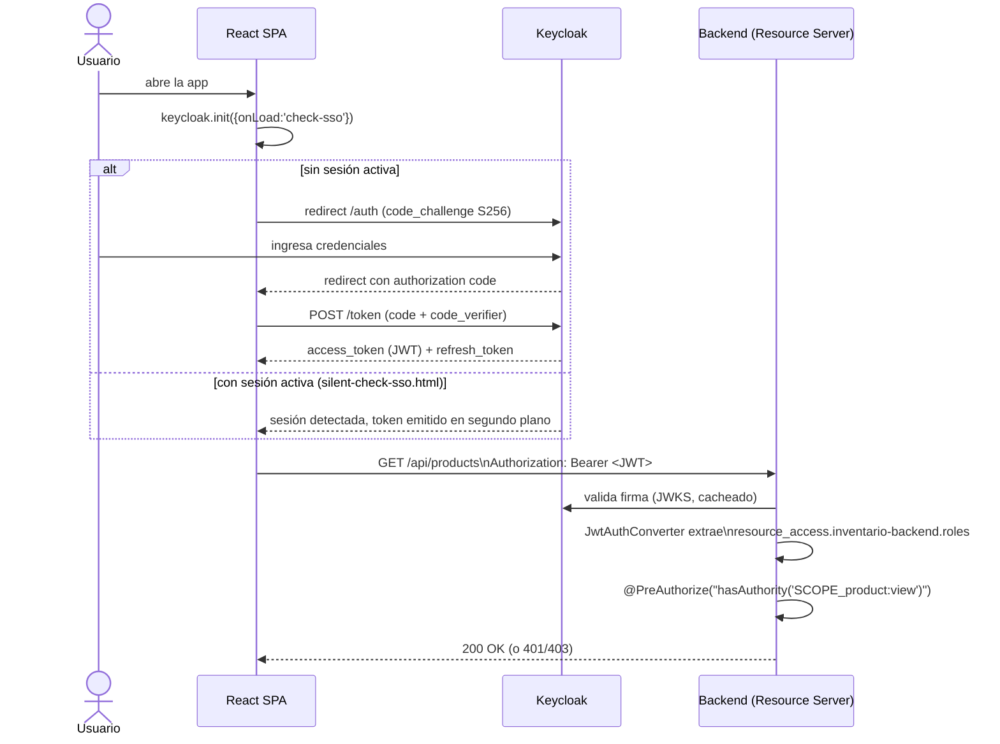

# Arquitectura

Documento técnico de arquitectura del Sistema de Gestión de Inventarios. Para
el detalle de cada decisión (verificaciones, bugs encontrados, alcance exacto
de cada ticket), ver `CLAUDE.md` (local, no versionado — ver nota al final de
este documento).

## Índice

1. [Visión general](#visión-general)
2. [Diagrama de componentes](#diagrama-de-componentes)
3. [Arquitectura del backend](#arquitectura-del-backend)
4. [Arquitectura del frontend](#arquitectura-del-frontend)
5. [Modelo de datos](#modelo-de-datos)
6. [Flujo de autenticación (OAuth2 PKCE)](#flujo-de-autenticación-oauth2-pkce)
7. [Arquitectura de observabilidad](#arquitectura-de-observabilidad)
8. [Decisiones tecnológicas (ADRs)](#decisiones-tecnológicas-adrs)

## Visión general

Monorepo con dos aplicaciones desplegables (frontend SPA, backend API REST),
un proveedor de identidad (Keycloak) y un stack de observabilidad completo
(métricas, logs, trazas), todo orquestado con Docker Compose. Es un
**monolito modular**, no microservicios (ver ADR-002) — decisión deliberada
dado el tamaño del equipo (2 personas).

| Capa | Tecnología | Rol |
|---|---|---|
| Cliente | React 18 + Vite | SPA, consume la API REST vía Axios |
| Identidad | Keycloak 24 | Emisión/validación de JWT, OAuth2 Authorization Code + PKCE |
| API | Spring Boot 3 (Java 21) | Lógica de negocio, persistencia, autorización por scope |
| Datos | PostgreSQL 16 | Persistencia relacional (aplicación + Keycloak, bases separadas) |
| Observabilidad | OTel Agent → Grafana Alloy → Prometheus/Loki/Tempo → Grafana | Métricas, logs y trazas correlacionados |

## Diagrama de componentes



## Arquitectura del backend

Paquetes bajo `com.inventario` (`backend/src/main/java/com/inventario/`):

```
controller/   → endpoints REST (Product, Stock, Dashboard, Report, Audit)
service/      → lógica de negocio (ProductService, StockService, ...)
repository/   → Spring Data JPA (ProductRepository, StockMovementRepository)
entity/       → entidades JPA (Product @Audited, StockMovement, enums)
dto/          → DTOs de request/response (nunca se exponen entidades JPA directamente)
mapper/       → MapStruct, DTO ↔ Entity
config/       → SecurityConfig, OpenAPIConfig, JpaAuditingConfig, BusinessMetricsConfig
security/     → JwtAuthConverter, KeycloakGrantedAuthoritiesConverter, CurrentUserResolver
audit/        → AuditRevisionEntity/AuditRevisionListener (Hibernate Envers, quién+cuándo)
exception/    → GlobalExceptionHandler (@RestControllerAdvice) + excepciones de negocio
```

Cada endpoint valida un **scope individual** (`@PreAuthorize("hasAuthority('SCOPE_product:view')")`),
nunca un rol genérico — ver [`docs/security/keycloak.md`](security/keycloak.md).
Las migraciones de esquema (Flyway, `V1`...`V8`) son inmutables una vez
aplicadas (ADR-005); auditoría de cambios sobre `Product` vía Hibernate
Envers, incluyendo el autor de cada revisión (`audit/`).

## Arquitectura del frontend

```
src/
├── components/   → common/, layout/, dashboard/, products/, stock/
├── pages/        → una página por ruta (LoginPage, DashboardPage, ProductsPage, ...)
├── routes/       → AppRoutes.jsx (React Router DOM v6)
├── context/      → AuthContext.jsx (estado global de autenticación)
├── hooks/        → useAuth, useProducts, useStock, useDashboard (React Query)
├── services/     → axiosConfig.js (interceptor de token), keycloak.js, *Service.js
└── styles/       → variables.css (design tokens) + CSS Modules por componente
```

Todo fetch de datos usa **React Query** (`useQuery`/`useMutation`, ADR-003) en
vez de `useState`/`useEffect` manual — maneja loading/caché/refetch/error de
forma consistente en todo el proyecto.

## Modelo de datos



`STOCK_MOVEMENT.quantity` guarda el delta con signo (positivo en `ENTRY`,
negativo en `EXIT`/`ADJUSTMENT` reductor); `PRODUCT.status` implementa soft
delete (ADR-001) — `DELETE /api/products/{id}` nunca borra la fila, la marca
`INACTIVE`, porque el historial de `stock_movements` tiene FK a `products`.
Detalle completo del esquema y constraints en `CLAUDE.md` sección 5.

## Flujo de autenticación (OAuth2 PKCE)



El frontend nunca guarda el JWT en `localStorage` (prohibido, sección 14 de
`CLAUDE.md`) — `keycloak-js` lo mantiene en memoria y lo refresca vía
`keycloak.updateToken(30)` antes de cada request (interceptor de Axios,
`services/axiosConfig.js`). Detalle completo de scopes/roles/usuarios en
[`docs/security/keycloak.md`](security/keycloak.md).

## Arquitectura de observabilidad

Cubierta en detalle, con diagrama de flujo de datos propio y guía de "dónde
mirar según lo que se busca", en
[`docs/observability/README.md`](observability/README.md). Resumen: el
backend corre instrumentado por el OpenTelemetry Java Agent (sin cambios en
código de producción, ADR-006) y exporta métricas/trazas/logs por OTLP a
Grafana Alloy, que los enruta en paralelo a Prometheus, Tempo y Loki — todo
visualizado en 4 dashboards de Grafana provisionados como código
(Aplicación, Infraestructura, Negocio, Seguridad) con 5 reglas de alerta
activas en Alertmanager.

## Decisiones tecnológicas (ADRs)

| ADR | Decisión | Razón (resumen) |
|---|---|---|
| ADR-001 | Soft delete en productos (`status=INACTIVE`) | El historial de stock tiene FK a `products`; borrar rompería la integridad referencial |
| ADR-002 | Monolito modular, no microservicios | Equipo de 2 personas; la complejidad operativa de microservicios no está justificada |
| ADR-003 | React Query para todo fetch de datos | Loading/caché/refetch/error consistentes, sin `useState`/`useEffect` manual repetido |
| ADR-004 | CSS puro (Modules + custom properties), sin frameworks de UI | Requisito explícito de la consigna académica |
| ADR-005 | Migraciones Flyway inmutables una vez aplicadas | Flyway valida checksums; modificar una migración ya ejecutada rompe el despliegue |
| ADR-006 | OpenTelemetry vía Java Agent, no SDK manual | Instrumentación automática de Spring Web/JDBC sin tocar código de producción |
| ADR-007 | Testcontainers con reuso habilitado en local | Evita levantar/bajar contenedores en cada corrida local; en CI siempre son frescos |
| ADR-008 | `keycloak/realm.json` exportado y versionado | Reproducibilidad total del ambiente de seguridad entre desarrolladores/CI |

> El detalle completo de cada ADR (con el texto de "Consecuencia" donde
> aplica) vive en `CLAUDE.md` sección 13. Ese archivo es intencionalmente
> local y no se versiona en GitHub (contiene el historial completo de
> decisiones día a día del proyecto) — este documento es la versión pública
> y estable de la arquitectura, pensada para no quedar desactualizada con
> cada ticket.
