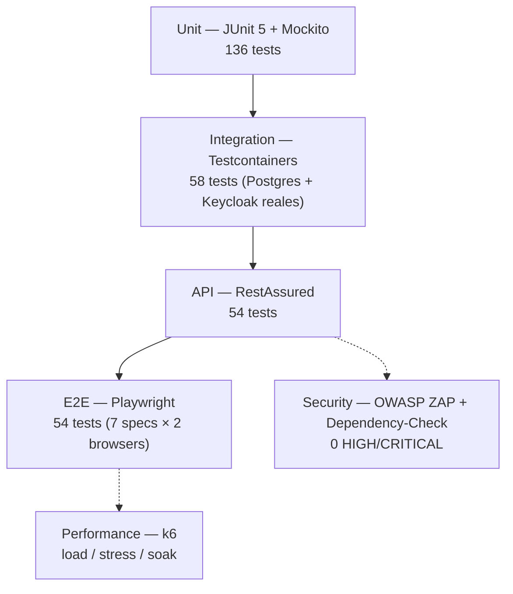

# Estrategia de Testing

Este proyecto implementa la pirámide de testing completa exigida por la
consigna académica — 6 niveles, del más rápido/aislado (unit) al más lento/
realista (E2E), más 2 dimensiones transversales (seguridad y performance).
Este documento resume qué existe hoy, dónde vive y cómo correrlo. El detalle
exacto de cada ticket (bugs encontrados, decisiones de diseño, verificación
contra el stack real) vive en `CLAUDE.md` (local, no versionado).

## Pirámide de testing



| Nivel | Herramienta | Cantidad real | Objetivo de cobertura |
|---|---|---|---|
| Unit | JUnit 5 + Mockito + AssertJ | **136 tests** | ≥ 70% líneas / 65% branches (gate real: 85%/65% en `ProductService`/`StockService`, ver abajo) |
| Integration | Testcontainers (PostgreSQL 16 + Keycloak 24 reales) | **58 tests** | Repositorios y servicios críticos |
| API | RestAssured (`@SpringBootTest(RANDOM_PORT)`) | **54 tests** | 100% de endpoints (auth, contrato, CRUD, errores) |
| E2E | Playwright (Chromium + Firefox) | **54 tests** (7 spec files × 2 browsers) | Flujos de usuario críticos |
| Security | OWASP ZAP (baseline + API scan) + Dependency-Check + Trivy | 0 HIGH/CRITICAL | Vulnerabilidades de app y de imágenes Docker |
| Performance | k6 (load/stress/soak) | 3 escenarios | p95 < 500ms, error rate < 1% |

Total backend: **248 tests** (`./gradlew test` → `build/test-results/test/`).
Total frontend unit: **62 tests** (Vitest + React Testing Library,
`npm run test`).

## 1. Unit tests (backend)

`backend/src/test/java/com/inventario/unit/` — mockean todas las
dependencias (`@Mock`/`@InjectMocks`, sin Spring context salvo en los
`@WebMvcTest` de controllers). Casos positivos y negativos por servicio
(sección 9 del backlog original): creación con datos válidos, SKU
duplicado, producto inexistente, stock insuficiente, validación de DTO, etc.

| Clase | Tests | Qué cubre |
|---|---|---|
| `ProductServiceTest` | 28 | CRUD completo + validación de DTO (100% líneas) |
| `StockServiceTest` | 28 | Entrada/salida/ajuste + alertas de stock bajo (100% líneas) |
| `ProductControllerTest` | 25 | Los 8 endpoints de `/api/products`, 200/201/204/400/401/403/404/409 |
| `StockControllerTest` | 13 | Los 6 endpoints de `/api/stock`, incluyendo 422 (stock insuficiente) |
| `DashboardControllerTest` / `DashboardServiceTest` | 9 / 4 | Los 4 endpoints de `/api/dashboard` |
| `AuditControllerTest` | 4 | `/api/audit/products/{id}/revisions`, scope `audit:view` |
| `ReportControllerTest` / `ReportServiceTest` | 3 / 1 | `/api/reports/inventory` |
| `JwtAuthConverterTest` | 7 | Extracción de scopes del JWT → `GrantedAuthority` |
| `SecurityAuditorAwareTest` | 5 | Resolución del usuario actual para `@CreatedBy`/Envers |
| `BusinessMetricsConfigTest` | 4 | Gauges de Micrometer (dashboard "Negocio", OBS-004) |
| `ProductRequestDTOValidationTest` | 5 | Validación Bean Validation (`@NotBlank`, `@Positive`, etc.) |

```bash
cd backend && ./gradlew test --tests "com.inventario.unit.*" jacocoTestReport
```

### Quality gate de cobertura (JaCoCo)

`jacocoTestCoverageVerification` (`backend/build.gradle.kts`) bloquea el
build si `ProductService`/`StockService` caen debajo de **85% líneas / 65%
branches** — acotado a esas 2 clases porque son las únicas con 100% de
cobertura *solo* con los tests unitarios (el resto del proyecto depende
también de los tests de integración/API para llegar a cifras altas, y ese
gate corre en un stage separado de CI que no siempre ejecuta antes).

```bash
cd backend && ./gradlew test jacocoTestReport jacocoTestCoverageVerification
```

## 2. Integration tests (Testcontainers)

`backend/src/test/java/com/inventario/integration/` — contra una base de
datos PostgreSQL **real** (nunca H2 ni mocks de repositorio), en un
contenedor Testcontainers fresco por ejecución.

| Clase | Tests | Qué prueba |
|---|---|---|
| `ProductRepositoryIntegrationTest` | 13 | Queries de `ProductRepository` (paginación, filtros, unicidad de SKU) |
| `StockMovementRepositoryIntegrationTest` | 7 | Historial paginado, top productos movidos (30 días) |
| `SecurityIntegrationTest` | 7 | Flujo OAuth2 completo contra un **Keycloak real** (Testcontainers) — único test que no mockea `JwtDecoder` |
| `DataIntegrityTest` | 11 | Constraints de PostgreSQL vía SQL crudo (SKU duplicado, precio negativo, FK, etc.) |
| `SeedDataTest` | 11 | El seed de `V8__insert_seed_data.sql` es reproducible desde cero |
| `FlywayMigrationTest` | 6 | Las 8 migraciones se aplican en orden, sin errores, y crean las tablas/columnas esperadas |
| `AuditServiceIntegrationTest` | 2 | `AuditService.getProductRevisions()` contra revisiones reales de Envers |
| `ProductAuditIntegrationTest` | 1 | Tablas `products_aud`/`revinfo` se pueblan al crear/editar un producto |

`SecurityIntegrationTest` es el único que levanta **2 contenedores**
(Postgres + Keycloak 24 con `keycloak/realm.json` real, copiado al classpath
de test automáticamente por Gradle — nunca duplicado a mano). En
Windows/Docker Desktop usa `KeycloakContainer.LOG_WAIT_STRATEGY` en vez del
`HttpWaitStrategy` por defecto (el wait HTTP falla intermitentemente por el
proxy de puertos del daemon, no por el contenedor en sí).

```bash
cd backend && ./gradlew test --tests "com.inventario.integration.*"
```

## 3. API tests (RestAssured)

`backend/src/test/java/com/inventario/api/` — contra un servidor HTTP real
(`@SpringBootTest(webEnvironment = RANDOM_PORT)` + Testcontainers Postgres),
con `@MockBean JwtDecoder` emitiendo tokens controlados por rol (más rápido
y determinístico que un Keycloak real — esa cobertura la da
`SecurityIntegrationTest`).

| Clase | Tests | Qué prueba |
|---|---|---|
| `ProductApiTest` | 22 | CRUD completo, paginación, búsqueda, stats, 404/409 |
| `StockApiTest` | 16 | Entrada/salida/ajuste, historial, alertas, 422 (stock insuficiente) |
| `AuthApiTest` | 11 | 401/403, token expirado/malformado, headers de seguridad, endpoints públicos |
| `ContractTest` | 5 | El JSON de las respuestas cumple el JSON Schema de sus DTOs; `/v3/api-docs` documenta los códigos reales |

```bash
cd backend && ./gradlew test --tests "com.inventario.api.*"
```

## 4. E2E tests (Playwright)

`frontend/tests/e2e/` — contra el stack completo corriendo (frontend Vite +
backend + Keycloak + PostgreSQL, vía `docker-compose.dev.yml` o
`docker-compose.staging.yml` con `BASE_URL`), en Chromium y Firefox.

| Spec | Escenarios |
|---|---|
| `auth.spec.js` | Login vía Keycloak → `/dashboard`; ruta protegida sin sesión; navbar/sidebar post-login; logout |
| `products.spec.js` | CRUD completo (crear/editar/eliminar), búsqueda, filtro por categoría |
| `stock.spec.js` | Entrada/salida/ajuste, stock insuficiente (422), alerta de stock bajo, historial paginado |
| `dashboard.spec.js` | Los 6 KPIs, accesos rápidos, productos en alerta, movimientos recientes, top productos |
| `permissions.spec.js` | `viewer` no ve controles de gestión (oculto en UI vía `hasScope`) ni puede mutar (403 del backend) |
| `responsive.spec.js` | Viewport 390px — login, dashboard, productos, stock sin overflow |
| `navigation.spec.js` | Sidebar, `aria-current`, breadcrumb, accesos rápidos |

`tests/fixtures/auth.js` (login/logout reutilizable, los 5 usuarios) y
`tests/pageObjects/` (Page Object Model para Productos y Stock) evitan
duplicar selectores entre specs. Reportes: HTML, JUnit XML y Allure
(`playwright.config.js`).

```bash
docker compose -f docker-compose.dev.yml up -d
cd frontend && npm run dev &          # otra terminal
npx playwright install chromium firefox   # primera vez
npx playwright test
```

## 5. Security testing

- **OWASP ZAP** — `zap-baseline.py` contra la imagen del frontend
  (spider + passive scan) y `zap-api-scan.py` contra `/v3/api-docs` del
  backend (spider + active scan dirigido). Gate real:
  `scripts/zap-report-gate.py` falla si hay al menos 1 alerta HIGH.
  Excepciones documentadas y verificadas una por una en
  `zap-ignore-rules.conf`.
- **OWASP Dependency-Check** — `./gradlew dependencyCheckAnalyze`, falla si
  hay dependencias con CVSS ≥ 9.0 (CRITICAL) en `runtimeClasspath`.
- **Trivy** — escanea ambas imágenes Docker finales (`--severity CRITICAL`);
  hallazgos aceptados con justificación en `backend/.trivyignore`. Ver
  "Detalle de CICD-004" en `CLAUDE.md`.

```bash
.github/workflows/security-scan.yml   # corre los 3 en CI
```

## 6. Performance testing (k6)

`tests/performance/` — corrido vía `docker run grafana/k6` (no instalado en
el host).

| Script | Perfil | Objetivo |
|---|---|---|
| `load-test.js` | 50 VU / 5 min, 3 escenarios (lectura/creación/stock) | p95 < 500ms, error < 1%, throughput > 100 req/s |
| `stress-test.js` | Ramping 10→50→100→200 VU / 8 min | Identificar el punto de quiebre real |
| `soak-test.js` | 50 VU constantes / 30 min | Sin evidencia de fuga de memoria (tasa de GC estable) |

```bash
docker run --rm -i --network inventario-network grafana/k6 run - < tests/performance/load-test.js
```

## 7. Exploratory testing

3 sesiones documentadas con formato SBTM (Session-Based Test Management) en
`docs/testing/`: [`exploratory-charter-01-auth.md`](exploratory-charter-01-auth.md)
(autenticación/autorización), [`exploratory-charter-02-forms.md`](exploratory-charter-02-forms.md)
(formularios/validaciones) y [`exploratory-charter-03-stock.md`](exploratory-charter-03-stock.md)
(flujos de stock, incluyendo una prueba real de concurrencia con 5 requests
simultáneas). Resumen consolidado con los hallazgos en
[`exploratory-testing-report.md`](exploratory-testing-report.md).

## Ejecución por etapa (resumen)

| Etapa | Qué corre |
|---|---|
| Local, antes de commit | Unit tests |
| Cada PR / push a `develop` | Unit + SonarQube + integration + API + build de imágenes Docker |
| Antes de desplegar a staging | Deploy de `docker-compose.staging.yml` |
| Staging ya desplegado | E2E (Playwright) + Security scan (ZAP baseline) |
| Bajo demanda / release | Performance (k6), Security completo (ZAP full + Dependency-Check), exploratory |

Detalle completo de los 10/12 stages de CI en
[`docs/cicd/jenkins.md`](../cicd/jenkins.md) y `CONTRIBUTING.md`.
