# Manual de Usuario

Guía de uso del Sistema de Gestión de Inventarios para usuarios finales,
ilustrada con capturas reales del sistema en funcionamiento. Para la
instalación/configuración técnica, ver el [`README.md`](../README.md); para
el detalle de permisos por rol, [`docs/security/keycloak.md`](security/keycloak.md).

> Las capturas de este manual se tomaron contra el entorno de desarrollo
> compartido del proyecto (`docker-compose.dev.yml`), que acumula datos de
> muchas sesiones de pruebas a lo largo del proyecto. Donde eso es visible
> (por ejemplo, en "Movimientos recientes" del dashboard, con entradas de
> pruebas de carga k6), se indica explícitamente — el resto de las capturas
> refleja el catálogo de ejemplo real (`V8__insert_seed_data.sql`) más
> datos creados durante la propia captura de este manual.

## Índice

1. [Iniciar sesión](#iniciar-sesión)
2. [Panel principal (Dashboard)](#panel-principal-dashboard)
3. [Gestión de productos](#gestión-de-productos)
4. [Gestión de stock](#gestión-de-stock)
5. [Permisos según tu rol](#permisos-según-tu-rol)
6. [Uso en móvil](#uso-en-móvil)
7. [Preguntas frecuentes](#preguntas-frecuentes)

## Iniciar sesión

Al abrir la aplicación (`http://localhost:5173` en desarrollo), verás la
pantalla de inicio de sesión:

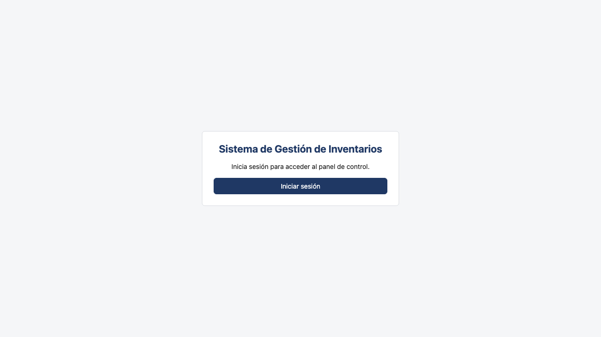

Click en **"Iniciar sesión"** te lleva al formulario de Keycloak, el
proveedor de identidad del sistema:

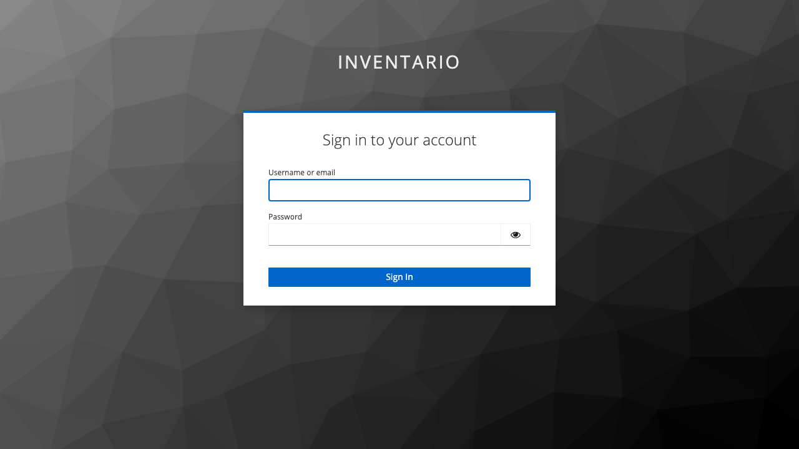

Ingresa tu usuario y contraseña corporativos y presiona **"Sign In"**. Si
las credenciales son correctas, volverás automáticamente al sistema, ya
autenticado, en el Dashboard.

> Los permisos que ves y las acciones que puedes realizar dependen de tu
> **rol** (`ADMIN`, `MANAGER`, `WAREHOUSE`, `VIEWER` o `AUDITOR`) — ver
> [Permisos según tu rol](#permisos-según-tu-rol).

## Panel principal (Dashboard)

Después de iniciar sesión llegas al Dashboard, el resumen general del
estado del inventario:

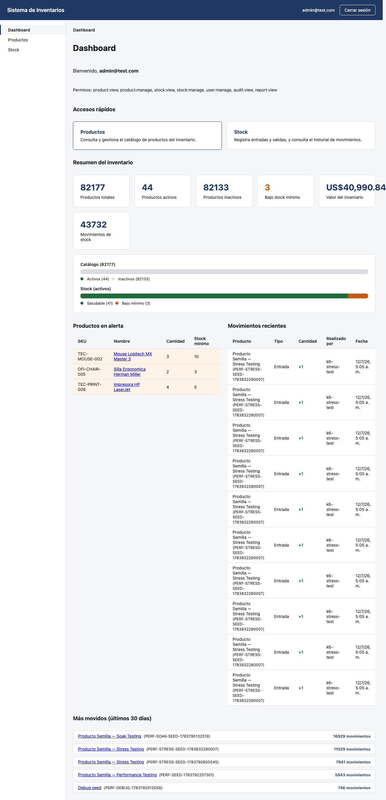

El Dashboard muestra:

- **Accesos rápidos** a Productos y Stock.
- **Resumen del inventario**: productos totales, activos, inactivos,
  productos bajo su stock mínimo, valor total del inventario (precio ×
  cantidad de todo lo activo) y cantidad total de movimientos de stock
  registrados.
- **Gráfico de catálogo y stock**: proporción de productos activos/
  inactivos, y de stock saludable vs. bajo mínimo.
- **Productos en alerta**: los productos cuya cantidad actual está por
  debajo de su stock mínimo configurado — requieren reabastecimiento.
- **Movimientos recientes**: las últimas 10 entradas/salidas/ajustes de
  stock registradas en el sistema, con quién las realizó.
- **Más movidos (últimos 30 días)**: qué productos han tenido más
  actividad de stock en el último mes.

> En la captura de arriba, "Movimientos recientes" y "Más movidos" incluyen
> entradas generadas por pruebas de carga (k6) contra este mismo ambiente
> de desarrollo compartido (usuario `k6-stress-test`) — en un ambiente de
> producción real, esas secciones reflejarían únicamente actividad genuina
> del negocio.

## Gestión de productos

### Ver el catálogo

La sección **Productos** (menú lateral) muestra el catálogo completo,
paginado, con búsqueda y filtros:

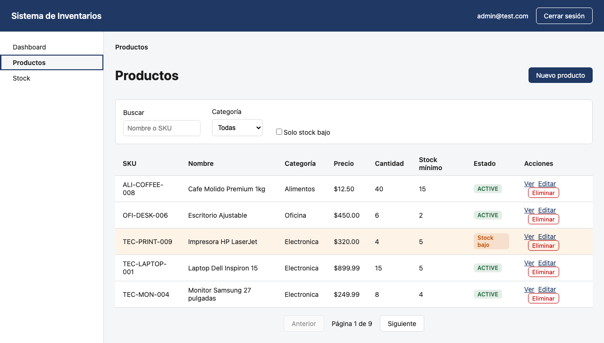

- **Buscar**: por nombre o SKU (coincidencia parcial).
- **Categoría**: filtra por una categoría específica.
- **Solo stock bajo**: muestra únicamente los productos bajo su mínimo.
- Cada fila muestra su estado (`ACTIVE` o el badge naranja "Stock bajo") y,
  según tu rol, las acciones disponibles (**Ver**, **Editar**, **Eliminar**).

### Crear un producto

Click en **"Nuevo producto"**. Si intentas guardar sin completar los campos
obligatorios, el formulario te muestra exactamente qué falta antes de
llamar al servidor:

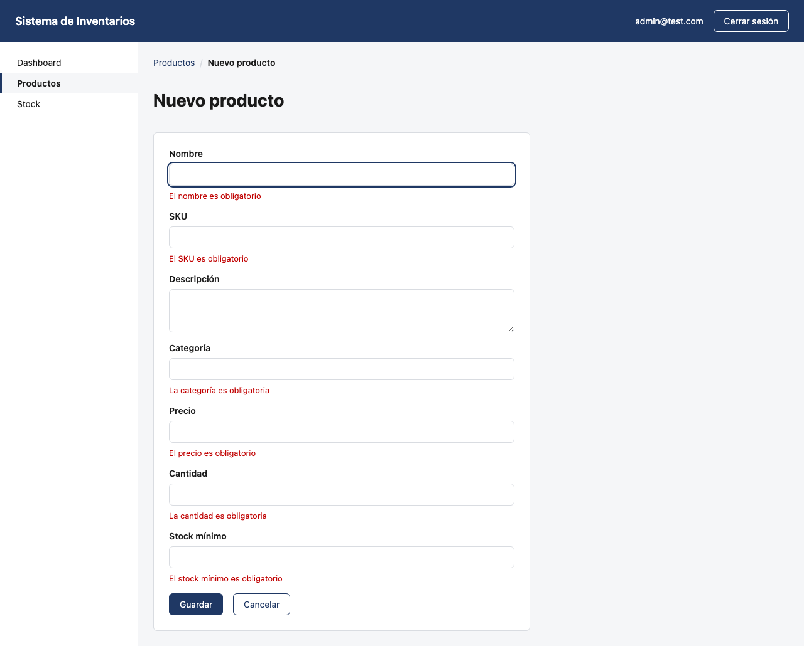

Completa los campos y guarda:

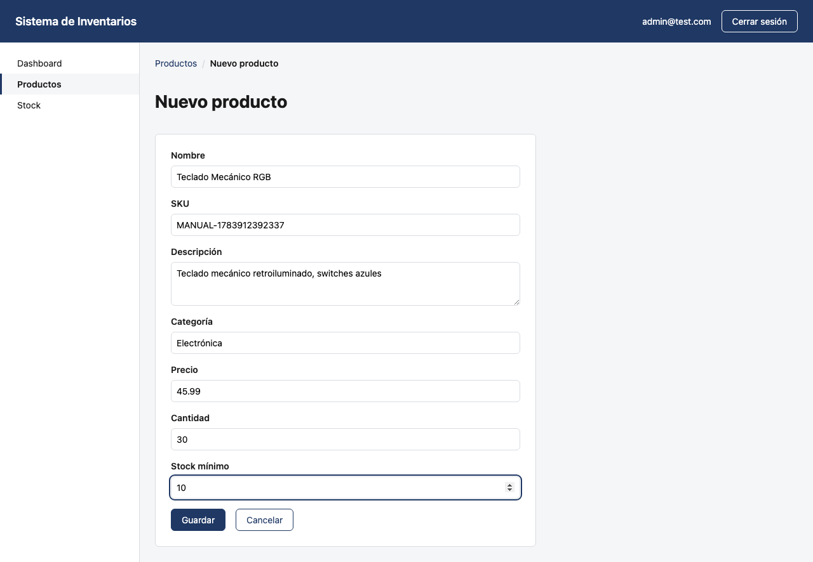

| Campo | Obligatorio | Notas |
|---|---|---|
| Nombre | Sí | Hasta 200 caracteres |
| SKU | Sí | Hasta 50 caracteres — **se guarda siempre en mayúsculas**, sin importar cómo lo escribas; debe ser único en todo el sistema |
| Descripción | No | Hasta 1000 caracteres |
| Categoría | Sí | Hasta 100 caracteres |
| Precio | Sí | Debe ser mayor que 0 |
| Cantidad | Sí | 0 o más |
| Stock mínimo | Sí | 0 o más — se usa para las alertas de stock bajo |

Al guardar, el producto aparece de inmediato en el listado:

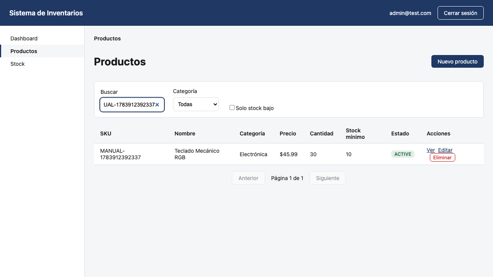

Si el SKU ya existe en el sistema, verás un mensaje de error indicando el
conflicto — el producto no se crea hasta que uses un SKU distinto.

### Editar un producto

Click en **"Editar"** sobre cualquier fila. El formulario se precarga con
los datos actuales del producto:

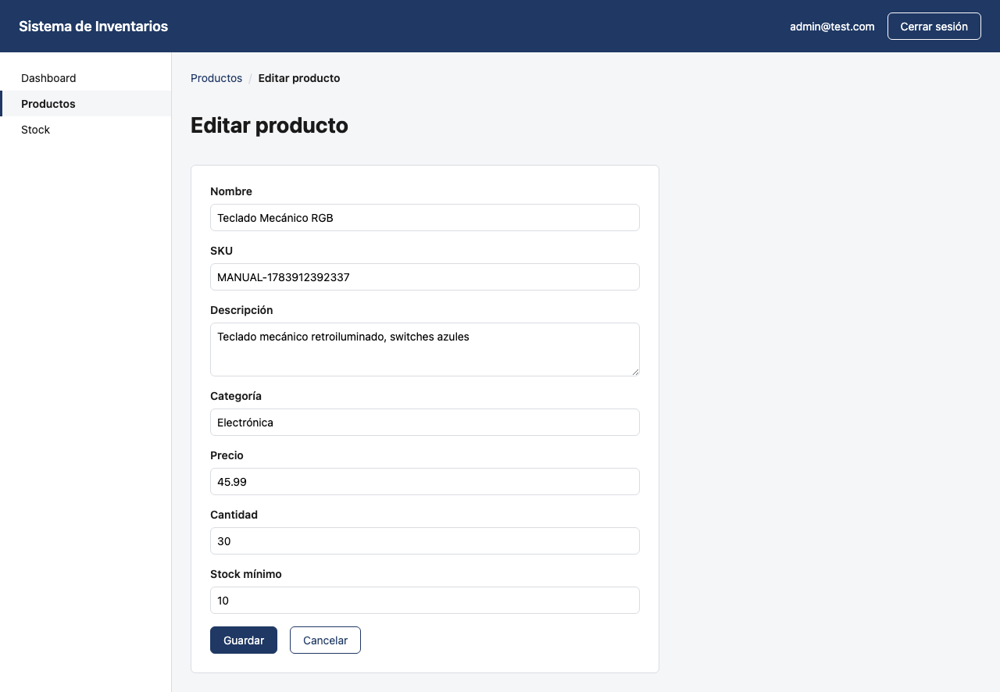

Modifica lo que necesites y guarda — los cambios se reflejan de inmediato
en el listado. Cada edición queda registrada en el historial de auditoría
del producto (quién la hizo y cuándo), consultable por un usuario con el
rol `AUDITOR` a través de la API (`GET /api/audit/products/{id}/revisions`
— no hay todavía una pantalla dedicada para esto en la interfaz).

### Eliminar un producto

Click en **"Eliminar"** y confirma. El producto desaparece del listado
activo, pero **no se borra físicamente** — queda marcado como inactivo,
preservando el historial de movimientos de stock asociado a él. Esta es
una decisión de diseño intencional del sistema (ver `docs/architecture.md`
ADR-001), no una limitación.

## Gestión de stock

La sección **Stock** (menú lateral) reúne las alertas de stock bajo, el
formulario para registrar movimientos y el historial completo:

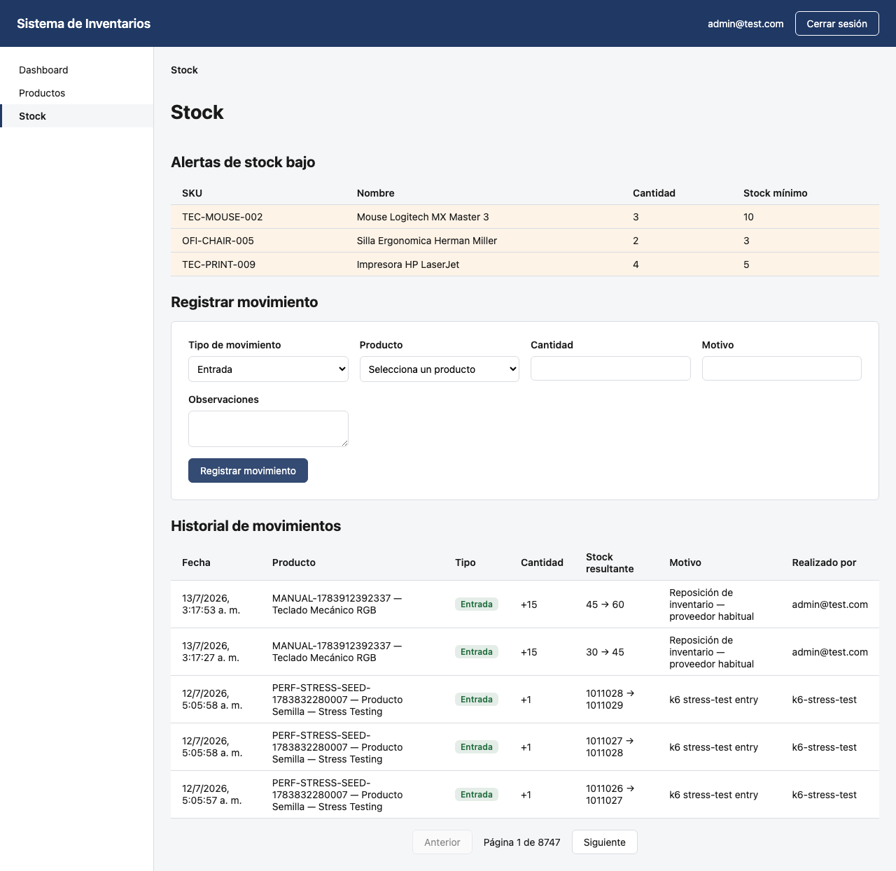

### Registrar una entrada, salida o ajuste

1. Elige el **tipo de movimiento**:
   - **Entrada**: mercancía que llega (compra, devolución de un cliente, etc.) — incrementa la cantidad.
   - **Salida**: mercancía que sale (venta, merma, etc.) — decrementa la cantidad. Si pides más de lo disponible, el sistema lo rechaza con un mensaje claro, sin dejar el stock en negativo.
   - **Ajuste**: fija la cantidad a un valor exacto — útil después de un conteo físico de inventario.
2. Selecciona el **producto**.
3. Según el tipo, indica la **cantidad** (Entrada/Salida) o la **nueva cantidad** (Ajuste).
4. Opcionalmente, indica un **motivo** y **observaciones**.
5. Click en **"Registrar movimiento"**.

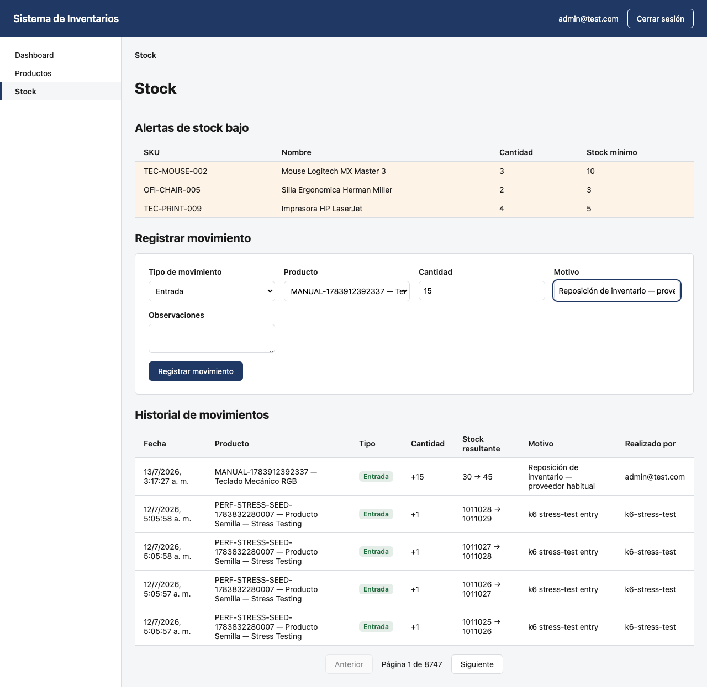

El movimiento aparece de inmediato al principio del **Historial de
movimientos**, con la cantidad anterior, la nueva cantidad, quién lo
registró y cuándo. Si la nueva cantidad queda por debajo del stock mínimo
del producto, este aparecerá automáticamente en la sección de **Alertas de
stock bajo** la próxima vez que recargues la página.

## Permisos según tu rol

No todos los usuarios ven las mismas opciones. Por ejemplo, un usuario con
rol `VIEWER` (solo lectura) no ve el botón "Nuevo producto" ni las acciones
de "Editar"/"Eliminar" — solo puede consultar:

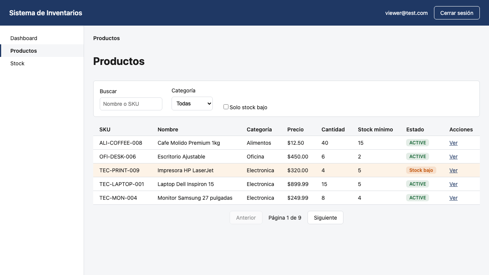

| Si tu rol es... | Puedes... |
|---|---|
| `ADMIN` | Todo — productos, stock, auditoría, reportes |
| `MANAGER` | Gestionar productos y stock, ver reportes (sin auditoría) |
| `WAREHOUSE` | Ver productos, gestionar stock (sin crear/editar/eliminar productos) |
| `VIEWER` | Solo consultar productos, stock y reportes — ningún control de gestión |
| `AUDITOR` | Consultar el historial de auditoría y reportes (sin ver el catálogo operativo día a día) |

Si intentas acceder a una acción que tu rol no permite (por ejemplo,
navegando directamente a una URL de edición), el sistema la rechaza con un
mensaje de error — la restricción real está en el servidor, la interfaz
solo la refleja para que no intentes algo que de todas formas será
rechazado.

## Uso en móvil

El sistema es responsive — funciona igual de bien en un teléfono:

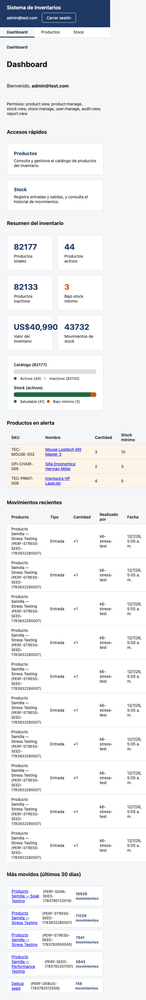

La navegación se reorganiza automáticamente, y todas las tablas se pueden
desplazar horizontalmente si no caben en la pantalla.

## Preguntas frecuentes

**¿Por qué no puedo eliminar un producto por completo?**
El sistema nunca borra productos físicamente — los marca como inactivos
para no perder el historial de movimientos de stock asociado. Es el
comportamiento esperado, no un error.

**Intenté una salida de stock y me dio error, ¿por qué?**
No puedes registrar una salida mayor a la cantidad disponible — el sistema
lo rechaza para evitar que el inventario quede en negativo. Verifica la
cantidad actual del producto antes de intentar de nuevo.

**Creé un producto con un SKU que ya existía y me dio error, ¿qué hago?**
Cada SKU debe ser único en todo el sistema (no distingue mayúsculas de
minúsculas). Usa un SKU diferente o edita el producto existente en vez de
crear uno nuevo.

**No veo el botón para crear/editar productos, ¿es un error?**
No — depende de tu rol. Ver [Permisos según tu rol](#permisos-según-tu-rol).
Si necesitas ese permiso, contacta a un administrador del sistema.

**¿Dónde veo quién hizo un cambio en un producto?**
Por ahora, el historial de auditoría (quién y cuándo cambió cada producto)
se consulta vía la API (`/api/audit/products/{id}/revisions`), disponible
para usuarios con rol `AUDITOR` o `ADMIN`. Una pantalla dedicada en la
interfaz para esto está pendiente en el backlog del proyecto.
